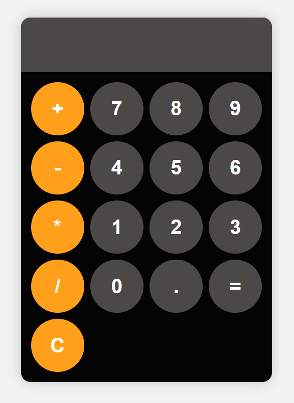

# 🧮 JavaScript Calculator

A simple and functional calculator built using **HTML**, **CSS**, and **JavaScript**. Perfect for quick calculations and learning how to build interactive web apps from scratch.

## 🎬 Demo
<a href="https://siddhesh-kulkarni.github.io/JS-Calculator/" target="_blank">Check here Live Demo</a>




## 🚀 Features

✨ Perform basic arithmetic: `+`, `−`, `×`, `÷`  
✨ Decimal number support  
✨ Error handling using `try...catch`  
✨ Clear (`C`) button to reset the display  
✨ Responsive and clean UI layout  

## 🔧 Getting Started

Follow these steps to run the calculator on your local machine:

1. 📥 **Clone the repository or download the source code**  
   ```bash
   git clone https://github.com/siddhesh-kulkarni/js-calculator.git
   cd js-calculator
